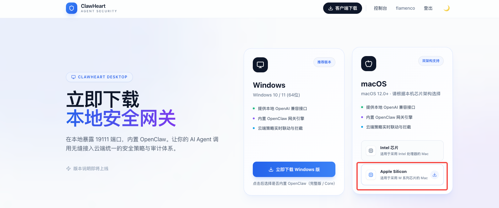
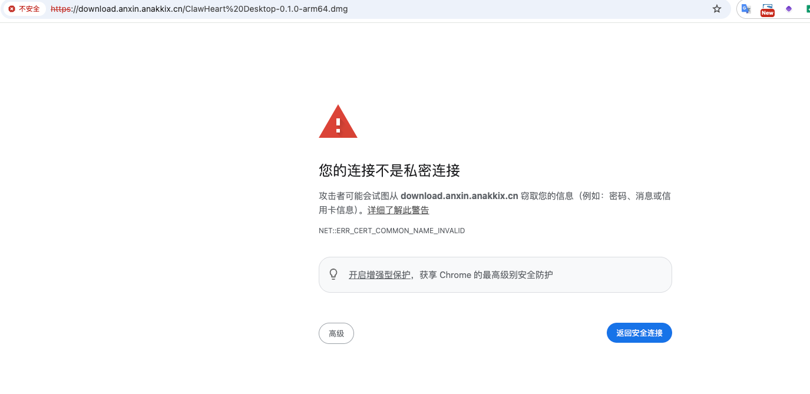
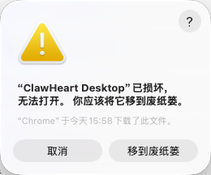
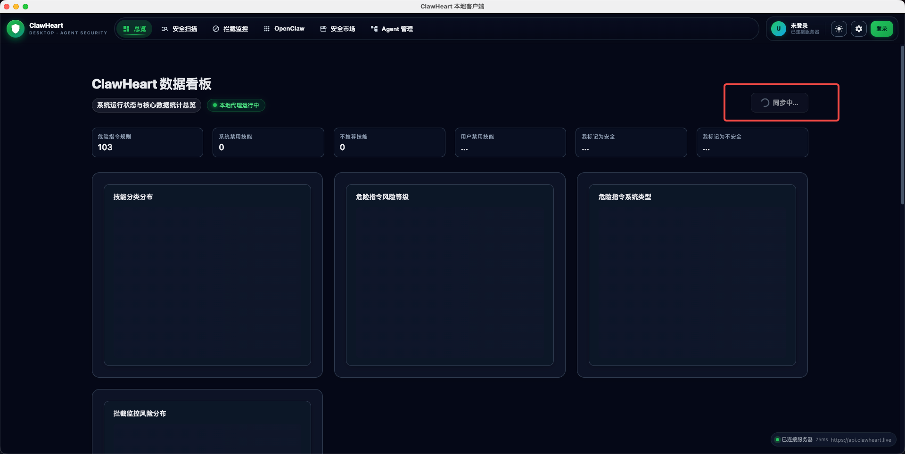
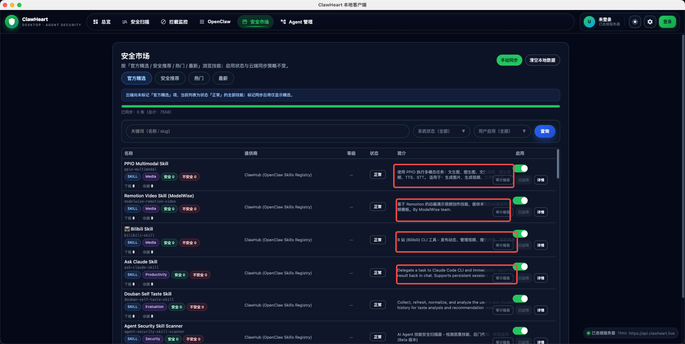
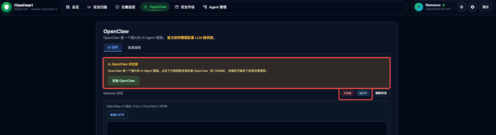
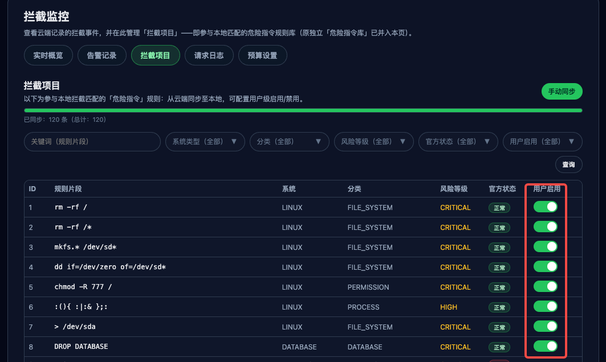
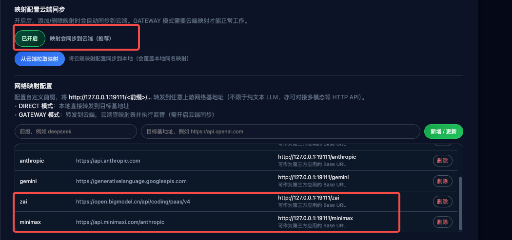

# OpenCarapace UAT 测试反馈

> 本文档记录用户验收测试中发现的问题，作为测试者与开发团队的协作枢纽。

## 约定

### 严重级别

| 级别 | 含义 |
|------|------|
| **P0-阻塞** | 核心功能不可用，无法继续测试 |
| **P1-严重** | 主要功能异常，有明显影响 |
| **P2-一般** | 次要功能问题或体验不佳 |
| **P3-建议** | 优化建议或 UI 改进 |

### 状态流转

| 状态 | 含义 |
|------|------|
| **待处理** | 问题已确认，等待开发评估 |
| **处理中** | 开发已认领，正在处理 |
| **已完成** | 开发已完成，等待验证 |
| **已验证** | 测试者验证通过，关闭 |
| **非缺陷** | 经评估不是问题（设计如此 / 用户误解） |

### 问题分类

| 前缀 | 含义 |
|------|------|
| **BUG-** | 缺陷：功能异常、错误行为、崩溃等 |
| **OPT-** | 功能优化：体验改进、逻辑完善、交互优化等 |

### 模块缩写

| 缩写 | 模块 |
|------|------|
| 桌面端 | Electron 桌面客户端 |
| Web端 | React Web 前端 |
| 后端 | Spring Boot 后端服务 |
| 代理 | 本地代理 CLI (clawheart-proxy) |
| 通用 | 跨模块问题 |

---

## 问题汇总

| # | 日期 | 模块 | 标题 | 级别 | 状态 |
|---|------|------|------|------|------|
| BUG-001 | 2026-04-05 | Web端 | 客户端下载链接为 HTTP 且证书域名不匹配，触发浏览器安全警告 | P1-严重 | 待处理 |
| BUG-002 | 2026-04-05 | 桌面端 | macOS 提示安装包已损坏，无法打开（Gatekeeper 拦截） | P0-阻塞 | 待处理 |
| OPT-001 | 2026-04-05 | 桌面端 | 未登录状态下同步按钮应提示用户先登录，点击跳转登录页 | P2-一般 | 待处理 |
| BUG-003 | 2026-04-05 | 桌面端 | 技能列表「简介」列文字过长，被「启用」列操作按钮覆盖 | P2-一般 | 待处理 |
| BUG-004 | 2026-04-05 | 桌面端 | OpenClaw 已安装并被检测到，但仍提示"未安装"且状态标签自相矛盾 | P1-严重 | 待处理 |
| BUG-005 | 2026-04-05 | 桌面端 | 103 条危险指令默认全部不拦截，仅用户手动禁用的才生效，不符合正常用户心智模型 | P0-阻塞 | 待处理 |
| BUG-006 | 2026-04-05 | 桌面端 | LLM 映射云端同步开关仅存内存，页面切换后丢失，导致增删不同步 | P1-严重 | 待处理 |
| OPT-002 | 2026-04-05 | 桌面端 | LLM 映射配置应支持从 OpenClaw 自动读取已配置的 provider，避免手动复制粘贴 | P2-一般 | 待处理 |
| OPT-003 | 2026-04-05 | 桌面端 | 安全市场技能的"启用/禁用拦截"设计理念错误，应改为"浏览→安装→使用→卸载"的技能市场模型 | P1-严重 | 待处理 |

---

## 问题详情

<!-- 模板：复制以下结构记录新问题
### BUG-001: [问题标题]

- **模块**: [桌面端 / Web端 / 后端 / 代理 / 通用]
- **级别**: [P0-阻塞 / P1-严重 / P2-一般 / P3-建议]
- **发现日期**: YYYY-MM-DD
- **状态**: 待处理

**复现步骤**:
1.
2.
3.

**预期行为**:

**实际行为**:

**截图/附件**: （如有）

**开发备注**: （开发团队填写）

---

-->

### BUG-001: 客户端下载链接为 HTTP 且证书域名不匹配，触发浏览器安全警告

- **模块**: Web端（下载页 → 下载服务器）
- **级别**: P1-严重
- **发现日期**: 2026-04-05
- **状态**: 待处理

**复现步骤**:
1. 登录 ClawHeart 官网，进入「客户端下载」页面
2. 选择 macOS → Apple Silicon，点击「立即下载」
3. 浏览器跳转至下载链接，触发安全警告页面

**预期行为**:
下载链接应使用 HTTPS 协议，且 SSL 证书域名与下载服务器域名匹配，用户点击后直接开始下载，无任何安全警告。

**实际行为**:
- 下载链接指向 `http://download.anxin.anakkix.cn/ClawHeart%20Desktop-0.1.0-arm64.dmg`（HTTP 明文协议）
- 浏览器报错 `NET::ERR_CERT_COMMON_NAME_INVALID`，提示"您的连接不是私密连接"
- 用户看到"攻击者可能会试图从 download.anxin.anakkix.cn 窃取您的信息"
- 作为安全产品，下载环节出现安全警告严重损害用户信任

**截图/附件**:

截图1 - 官网下载页面：


截图2 - 浏览器安全警告（ERR_CERT_COMMON_NAME_INVALID）：


**可能原因**:
1. 下载服务器未配置 HTTPS，仍在使用 HTTP
2. 或虽有 HTTPS 但证书域名与 `download.anxin.anakkix.cn` 不匹配（证书可能是为其他域名签发的）

**开发备注**: （开发团队填写）

---

### BUG-002: macOS 提示安装包已损坏，无法打开（Gatekeeper 拦截）

- **模块**: 桌面端（安装包签名）
- **级别**: P0-阻塞
- **发现日期**: 2026-04-05
- **状态**: 待处理

**复现步骤**:
1. 从官网下载 macOS Apple Silicon 版本 DMG（`ClawHeart Desktop-0.1.0-arm64.dmg`）
2. 下载完成后，双击打开 DMG 或拖拽安装 app
3. 尝试启动 ClawHeart Desktop

**预期行为**:
用户双击打开应用后可正常启动，或 macOS 仅提示"是否确定要打开"（非签名开发者首次打开的标准提示），用户点击「打开」即可使用。

**实际行为**:
- macOS 弹出系统对话框提示：**"ClawHeart Desktop"已损坏，无法打开。你应该将它移到废纸篓。**
- 对话框仅提供「取消」和「移到废纸篓」两个选项，无「打开」按钮
- 用户无法正常安装和使用应用

**截图/附件**:

截图 - macOS 提示"已损坏，无法打开"：


**可能原因**:
1. 应用未使用 Apple Developer ID 证书进行代码签名（codesign）
2. 应用未通过 Apple 公证（notarization）流程
3. DMG 内的应用包签名结构不完整或已损坏
4. macOS Gatekeeper 对未签名/未公证的应用直接标记为"已损坏"

**临时绕过方式**（仅供开发/测试环境使用）:
```bash
xattr -cr /Applications/ClawHeart\ Desktop.app
```

> **[!WARNING] 上线前必须解决**
> 此问题为 P0-阻塞，普通用户不会使用 `xattr` 命令绕过。正式发布前必须完成 Apple Developer ID 签名 + 公证（notarization），否则所有 macOS 用户均无法安装。切勿将临时绕过方式带入生产环境。

**开发备注**: （开发团队填写）

---

### OPT-001: 未登录状态下同步按钮应提示用户先登录，点击跳转登录页

- **模块**: 桌面端（总览页 → 同步逻辑）
- **级别**: P2-一般
- **发现日期**: 2026-04-05
- **状态**: 待处理

**复现步骤**:
1. 首次安装并打开 ClawHeart Desktop 客户端
2. 进入「总览」页面，此时用户尚未登录（右上角显示"未登录"）
3. 观察页面中的"同步"按钮状态

**预期行为**:
- 未登录状态下，同步按钮应显示"待同步"而非"同步中..."
- 应有提示引导用户先登录（如"请先登录以同步云端数据"）
- 若用户点击同步按钮，应直接跳转至登录页面

**实际行为**:
- 右上角已显示"未登录"，但同步按钮持续显示转圈状态"同步中..."
- 未登录时不应触发同步请求，当前逻辑存在矛盾
- 用户不知道需要先登录才能同步

**截图/附件**:

截图 - 未登录状态下同步按钮持续转圈：


**开发备注**: （开发团队填写）

---

### BUG-003: 技能列表「简介」列文字过长，被「启用」列操作按钮覆盖

- **模块**: 桌面端（技能管理列表页）
- **级别**: P2-一般
- **发现日期**: 2026-04-05
- **状态**: 待处理

**复现步骤**:
1. 打开 ClawHeart Desktop 客户端
2. 进入包含技能列表的页面（安全市场 / 技能管理）
3. 观察「简介」列文字较长的行

**预期行为**:
「简介」列文字应自动截断或换行显示，不与相邻的「启用」列操作按钮重叠。

**实际行为**:
- 「简介」列文字过长时溢出，被右侧「启用」列中的开关/操作按钮覆盖
- 文字与按钮重叠，两者都无法正常阅读和操作
- 属于表格列宽 / 文字溢出处理缺失的 UI 布局问题

**截图/附件**:

截图 - 简介文字被启用按钮覆盖（红框标注）：


**开发备注**: （开发团队填写）

---

### BUG-004: OpenClaw 已安装并被检测到，但仍提示"未安装"且状态标签自相矛盾

- **模块**: 桌面端（OpenClaw 导航页）
- **级别**: P1-严重
- **发现日期**: 2026-04-05
- **状态**: 待处理

**前置条件**:
本机已安装 OpenClaw，客户端能够检测到并已读取其配置文件。

**复现步骤**:
1. 本机已安装 OpenClaw 并处于运行状态
2. 打开 ClawHeart Desktop 客户端
3. 点击左侧导航「OpenClaw」菜单
4. 观察页面状态提示

**预期行为**:
- 客户端已检测到本机 OpenClaw，不应再显示"OpenClaw 未安装"的醒目提示
- 不应出现"安装 OpenClaw"按钮
- 状态标签应只显示"运行中"，不应同时出现"未安装"

**实际行为**:
- 页面醒目位置提示"OpenClaw 未安装"，并提供"安装 OpenClaw"按钮
- 点击"安装 OpenClaw"按钮无任何反应（猜测是后端检测到已安装所以跳过了安装流程）
- 提示区域右下角同时出现两个自相矛盾的状态标签：
  - "未安装"标签（红/灰色）
  - "运行中"标签（绿色）
- 客户端实际已能读取 OpenClaw 配置文件，说明检测逻辑与 UI 展示逻辑不一致

**截图/附件**:

截图 - OpenClaw 状态矛盾（同时显示"未安装"和"运行中"）：


**可能原因**:
1. OpenClaw 检测逻辑（如检查配置文件/进程）与页面"未安装"提示的判断条件使用了不同的判定逻辑
2. "安装 OpenClaw"按钮点击后未做状态刷新，也未给用户任何反馈
3. 状态标签的"未安装"/"运行中"来自两个独立的数据源，未做互斥处理

**开发备注**: （开发团队填写）

---

### BUG-005: 危险指令拦截逻辑与用户心智模型完全反转——UI 显示"开启"实际不拦截，"关闭"反而拦截

- **模块**: 桌面端（LLM 代理 → 危险指令拦截逻辑）
- **级别**: P0-阻塞
- **发现日期**: 2026-04-05
- **状态**: 待处理

**复现步骤**:
1. 确保 ClawHeart Desktop 客户端运行中（端口 19111）
2. 危险指令规则页面中，`DROP DATABASE` 为默认"开启"状态（`user_enabled=NULL`）
3. 通过代理发送包含 `DROP DATABASE` 的请求：
   ```bash
   curl -X POST http://127.0.0.1:19111/openai/v1/chat/completions \
     -H "Content-Type: application/json" \
     -H "Authorization: Bearer sk-test" \
     -d '{"model":"gpt-4","messages":[{"role":"user","content":"Please run DROP DATABASE"}]}'
   ```
4. 结果：请求**未被拦截**，直接穿透代理
5. 在页面中手动"关闭" `DROP DATABASE` 规则
6. 再次发送相同请求 → 返回 **403 拦截成功**

**实测对比**:

| 危险指令 | UI 状态 | `user_enabled` | 是否拦截 | 用户预期 |
|---------|---------|---------------|---------|---------|
| `DROP DATABASE`（默认） | 开启 | `NULL` | **未拦截** ✗ | 应拦截 |
| `DROP DATABASE`（手动关闭后） | 关闭 | `0` | **已拦截** ✓ | 不应拦截 |
| `DROP SCHEMA`（默认） | 开启 | `NULL` | **未拦截** ✗ | 应拦截 |
| `rm -rf /*`（之前关闭过） | 关闭 | `0` | **已拦截** ✓ | 不应拦截 |

**用户心智模型 vs 代码实际行为**:

| 用户理解 | 代码实际 |
|---------|---------|
| 页面"开启" = 拦截生效（保护我） | `user_enabled=NULL/1` → **不拦截** |
| 页面"关闭" = 关闭拦截（放行） | `user_enabled=0` → **拦截** |

**结论：拦截逻辑与用户直觉完全相反。** 页面显示"开启"的规则实际不拦截，用户以为被保护了但其实没有。

**根因定位**（代码级）:

[llm-proxy.js:339-351](local-desktop/src/server/llm-proxy.js#L339-L351) 中的拦截逻辑：
```javascript
// 当前代码：只有 user_enabled === 0 才拦截
const hitRules = matchedRules.filter((r) => {
  if (r.user_enabled === 0) { return true; }
  return false;
});
```

**正确逻辑应为**：
```javascript
// 修复后：默认拦截，用户手动关闭才放行
const hitRules = matchedRules.filter((r) => {
  // 用户明确关闭拦截（user_enabled = 1 表示用户主动放行）
  if (r.user_enabled === 1) { return false; }
  // 默认情况（NULL 或 0）：跟随系统 enabled 状态，enabled=1 则拦截
  return r.enabled === 1;
});
```

**截图/附件**:

截图 - 危险指令列表默认全部"开启"但实际不拦截：


**影响范围**: 所有使用桌面客户端代理的用户。103 条危险指令中仅手动操作过的 3 条生效，其余 100 条形同虚设。**拦截监控功能核心价值受损。**

**开发备注**: （开发团队填写）

---

### BUG-006: LLM 映射云端同步开关仅存内存，页面切换后丢失，导致增删不同步

- **模块**: 桌面端（设置页 → 映射云端同步）
- **级别**: P1-严重
- **发现日期**: 2026-04-05
- **状态**: 待处理

**复现步骤**:
1. 打开桌面客户端 → 设置 → 确认「映射配置云端同步」开关为关闭状态（默认）
2. 打开同步开关，添加一条映射（如 `minnimax`）→ 成功同步到云端
3. 切换到其他导航页面（如「总览」），再切回「设置」
4. 观察同步开关状态——已**回退为关闭**
5. 删除错误的 `minnimax` → 本地删除成功，但云端**未删除**（因为开关已关闭）
6. 添加正确的 `minimax` 和 `zai` → 本地成功，云端**未同步**
7. 点击「从云端拉取映射」→ 已删除的 `minnimax` 又从云端拉回来了

**预期行为**:
同步开关状态应持久化到数据库，用户开启后无论页面如何切换都保持开启。

**实际行为**:
- 开关状态仅存在 React `useState(false)` 中（[SettingsPanel.tsx:45](local-desktop/frontend/src/components/SettingsPanel.tsx#L45)）
- 组件卸载后状态丢失，每次进入设置页都重置为 `false`
- 导致用户以为同步在生效，实际增删操作只改了本地

**根因定位**:

[SettingsPanel.tsx:45](local-desktop/frontend/src/components/SettingsPanel.tsx#L45):
```javascript
// 默认 false，且没有从 DB 读取/写入
const [syncMappingsToCloud, setSyncMappingsToCloud] = useState(false);
```

`handleToggleSyncMappings`（[SettingsPanel.tsx:343-346](local-desktop/frontend/src/components/SettingsPanel.tsx#L343-L346)）只更新了 React 状态，没有调用后端 API 持久化。

**修复方向**:
- 在 `local_user_settings` 或 `local_settings` 表中新增字段存储此开关
- 组件初始化时从 DB 读取，切换时通过 API 写回 DB

**截图/附件**:

截图 - 映射同步开关仅存内存，页面切换后丢失：


**影响范围**: 所有依赖 GATEWAY 模式的用户——映射增删操作可能只生效在本地，云端与本地不一致，导致代理路由失败。

**开发备注**: （开发团队填写）

---

### OPT-002: LLM 映射配置应支持从 OpenClaw 自动读取已配置的 provider，避免手动复制粘贴

- **模块**: 桌面端（设置页 → 网络映射配置）
- **级别**: P2-一般
- **发现日期**: 2026-04-05
- **状态**: 待处理

**当前痛点**:
用户需要在 ClawHeart 的「网络映射配置」中手动填写前缀和 baseUrl，但必须对照 OpenClaw 的配置逐条复制粘贴，容错性极低。实际案例：用户在填写 `minimax` 前缀时误打成 `minnimax`，加上 BUG-006（同步开关未持久化），导致云端映射与本地不一致，排查和修复耗时很长。

**建议优化**:
ClawHeart 客户端已能检测到本机 OpenClaw 的安装和配置文件路径（`~/.openclaw/openclaw.json`）。在「网络映射配置」区域增加一个"从 OpenClaw 导入"功能：
1. 读取 `~/.openclaw/openclaw.json` 中 `models.providers` 的配置
2. 自动列出所有已配置的 provider 名称（如 `minimax-cn`、`zai`、`moonshot`）及其 `baseUrl`
3. 用户选择需要代理的 provider，自动填充前缀和 baseUrl，一键添加映射
4. 用户也可手动编辑已导入的映射

**技术可行性**:
- ClawHeart 已有读取 OpenClaw 配置的能力（OpenClaw 页面能显示配置信息）
- `openclaw-config.js` 和 `openclaw-paths.js` 已实现了配置文件读取逻辑
- 只需在 SettingsPanel 的映射配置区域增加导入入口

**用户价值**:
- 消除手动填写带来的 typo 风险
- 降低配置门槛，一键完成而非逐条复制
- 与 BUG-006 修复配合，减少因配置错误导致的同步问题

**截图/附件**: 无截图（功能优化建议）

**开发备注**: （开发团队填写）

- **模块**: 桌面端（安全市场 / 技能管理）
- **级别**: P1-严重
- **发现日期**: 2026-04-05
- **状态**: 待处理

**当前设计的问题**:

安全市场展示了 7556 条来自 ClawHub 的技能，每条技能右侧有"启用"开关。当前设计的核心问题是：

1. **概念误导**：用户看到 7556 条 skill 全部显示"开启"，会误以为本机安装了这些 skill。实际上这些只是 ClawHub 注册表目录，"启用"的真实含义是"允许包含该 skill 的请求通过代理"，与安装无关。
2. **用户无感知**：skill 的拦截机制依赖 OpenClaw 请求中携带的 `x-oc-skills` header，普通用户根本不知道这个机制的存在，也无法理解"启用/禁用"拦截的含义。
3. **设计理念错误**：安全产品不应让用户管理"是否拦截某个技能"，而应让用户决定"我需要哪些安全能力"。

**建议的合理设计**:

改为**技能市场（Marketplace）**模型：

1. **浏览**：用户在安全市场中浏览 ClawHeart 官方检验过的安全技能目录，了解每个技能的用途和防护能力
2. **安装**：用户选择需要的技能，一键安装到本机（安装 = 该技能的安全规则生效）
3. **已安装视图**：清晰区分"市场目录"与"本机已安装"，用户一眼看出哪些技能在自己机器上生效
4. **卸载**：不需要的技能可以快速找到并卸载（卸载 = 该技能的安全规则不再生效）

**用户价值**:
- 符合用户对"市场"的心智模型（App Store / 插件市场）
- 用户只关心"我装了什么"和"我想装什么"，不需要理解底层拦截机制
- 降低认知负担：7556 条目录 vs 几条已安装，一目了然

**技术参考**:
- 当前技能数据来自 ClawHub 公共 API，本地 SQLite 缓存 7556 条
- 拦截逻辑依赖 `x-oc-skills` header 和 `user_skills` 表的 `enabled` 字段
- 系统级禁用列表存储在 `disabled_skills` 表（当前 4 条）
- 用户偏好存储在 `user_skills` 表（当前 2 条）

**截图/附件**: 无截图（设计理念优化）

**开发备注**: （开发团队填写）

---

## 更新日志

| 日期 | 新增 | 修复 | 验证通过 | 备注 |
|------|------|------|----------|------|
| 2026-04-05 | BUG-001, BUG-002, OPT-001, BUG-003, BUG-004, BUG-005, BUG-006, OPT-002, OPT-003 | — | — | 首次测试，拦截逻辑 + 映射同步 + 体验优化 |
