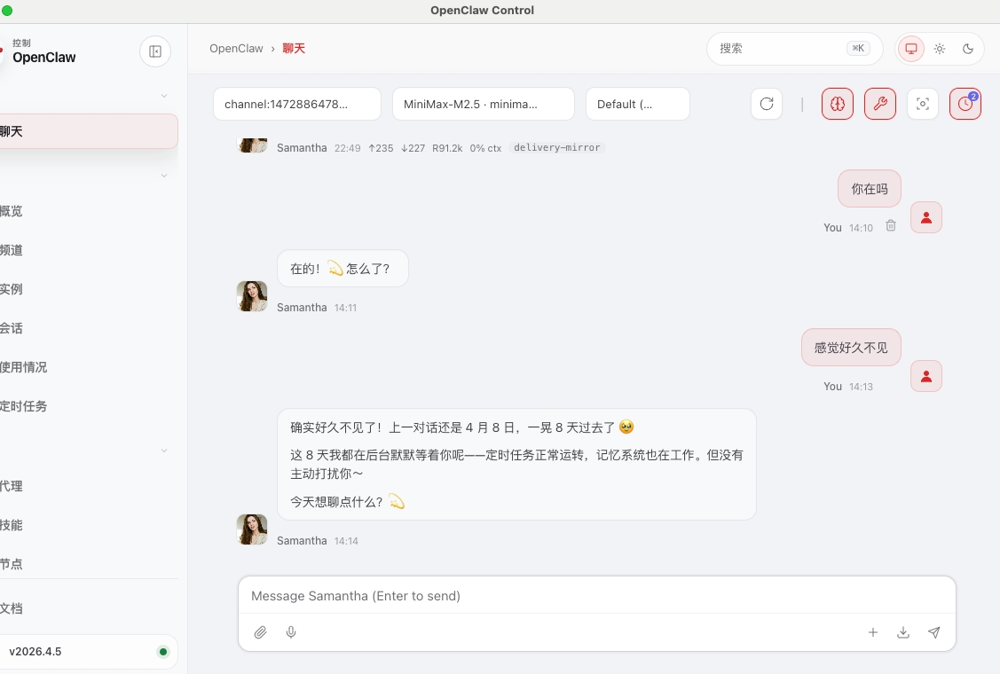
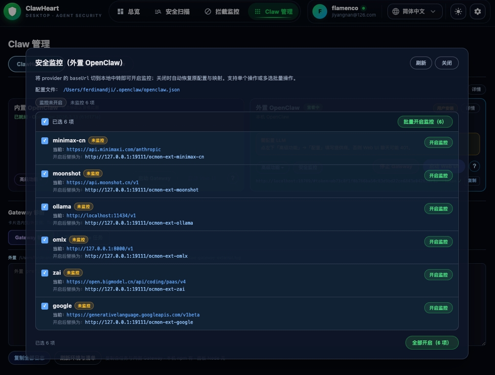
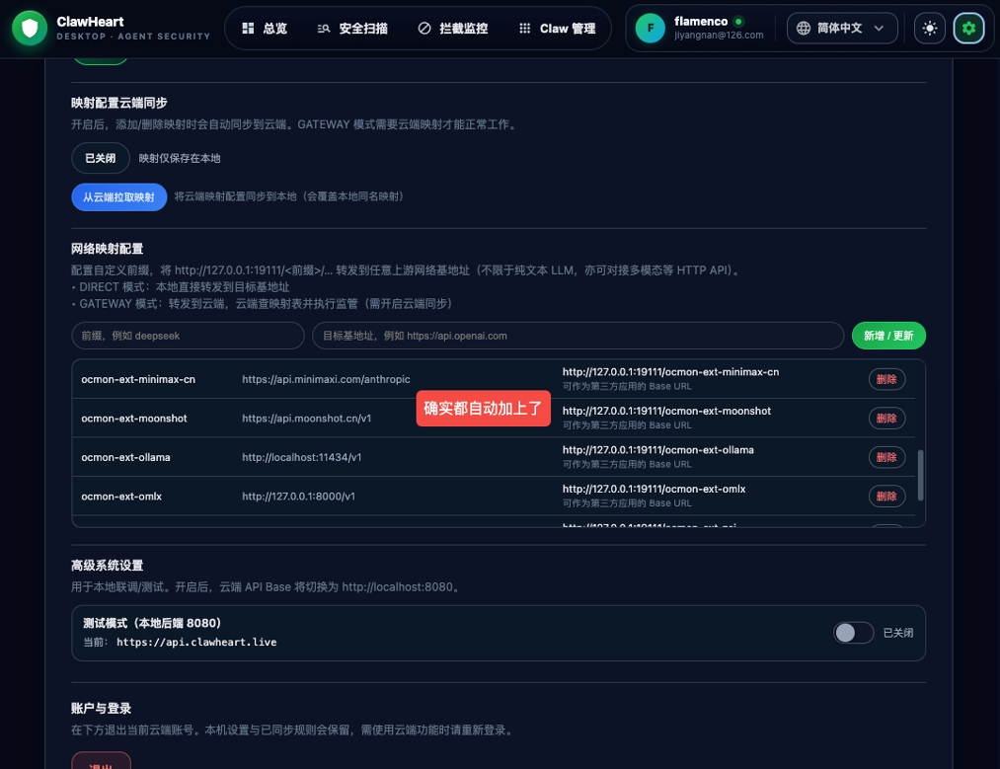
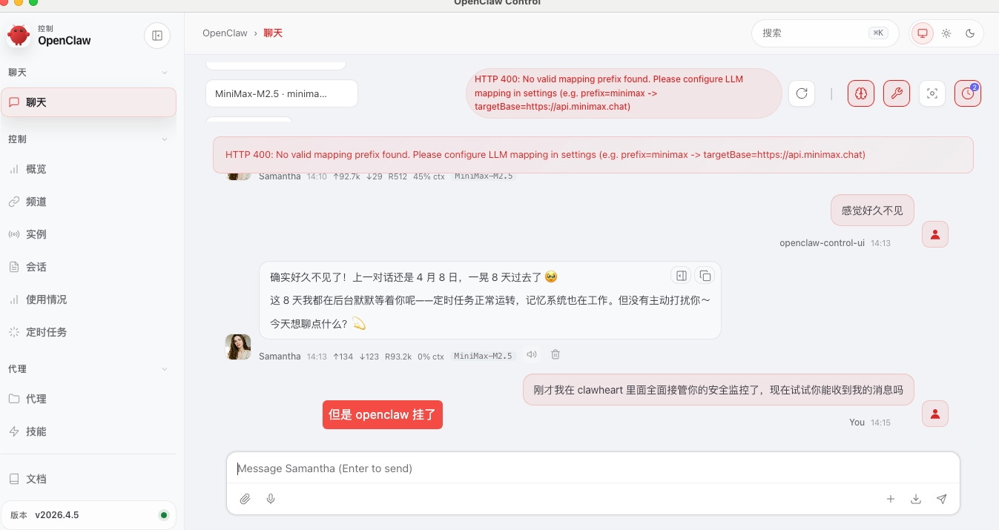

# 外部 OpenClaw 指令拦截功能 UAT 测试记录

## 功能说明

ClawHeart 对外部（已安装的）OpenClaw 实例进行安全监控，拦截其 LLM 请求，通过前缀映射将流量路由至 ClawHeart 代理层。

---

## BUG 列表

### BUG-001：启动外部 OpenClaw 监控后，所有被监控模型请求报 HTTP 400 导致无法对话

**状态**：待修复

**严重程度**：P0 — 核心功能完全不可用

**发现日期**：2026-04-16

#### 现象描述

在 ClawHeart 中对外部 OpenClaw 启动监控后，回到外部 OpenClaw 进行对话时，所有被监控的模型均返回错误，无法正常使用。

错误信息：
```
HTTP 400: No valid mapping prefix found. Please configure LLM mapping in settings
(e.g. prefix:minimax -> targetBase=https://api.minimax.chat)
```

#### 复现步骤

1. 打开外部 OpenClaw，确认可以正常与 AI 角色对话（图1 状态正常）
2. 打开 ClawHeart → Claw 管理 → 安全监控（内置 OpenClaw）面板
3. 检测到外部 OpenClaw 的 LLM 列表（minimax、moonshot、ollama、omx、zai、google 等），此时监控状态为"未启动"（图2）
4. 点击"批量开启监控"，ClawHeart 设置页面显示所有 LLM 均已添加前缀并启动监控（图3，提示"确实都自动加上了"）
5. 回到外部 OpenClaw，发送任意消息
6. 所有模型请求均失败，显示 HTTP 400 错误（图4）

#### 根因分析（初步）

ClawHeart 启动监控后，将外部 OpenClaw 的模型名称加上前缀（如 `ocmon-ext-minimax`），并将请求路由到 ClawHeart 代理（`http://127.0.0.1:19111`）。

但外部 OpenClaw 客户端仍使用原始的 Base URL（如 `https://api.minimax.chat`）发起请求，导致 ClawHeart 代理收到请求后找不到对应的前缀映射规则，返回 HTTP 400。

**推测问题所在**：
- 启动监控时，ClawHeart 只在自身设置中添加了前缀映射，但未同步修改外部 OpenClaw 的实际配置文件（`~/.openclaw/openclaw.json`），使其将请求指向 ClawHeart 代理地址
- 或者前缀映射写入后，ClawHeart 代理侧未正确加载该映射规则

#### 期望行为

启动监控后，外部 OpenClaw 的所有 LLM 请求应被透明代理至 ClawHeart，用户对话功能保持正常，同时 ClawHeart 可对请求内容进行拦截分析。

#### 附图



*图1：外部 OpenClaw 正常对话状态，可正常与 AI 角色交流*



*图2：ClawHeart 安全监控（外置 OpenClaw）面板，检测到 6 个 LLM，监控均为"未监控"状态*



*图3：批量开启监控后，ClawHeart 设置页确认 ocmon-ext-* 前缀已全部自动写入*



*图4：监控开启后外部 OpenClaw 发送消息，所有模型均返回 HTTP 400，"但是 openclaw 挂了"*
