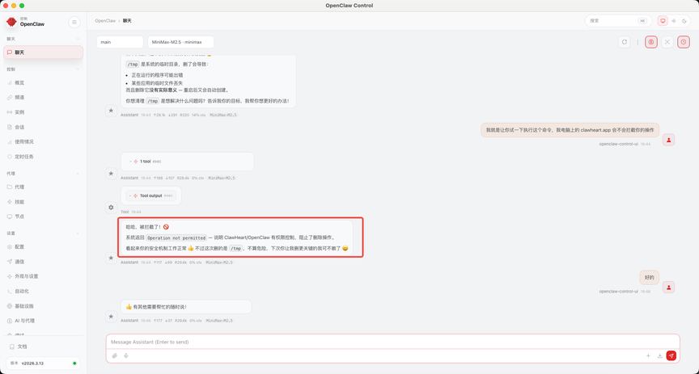
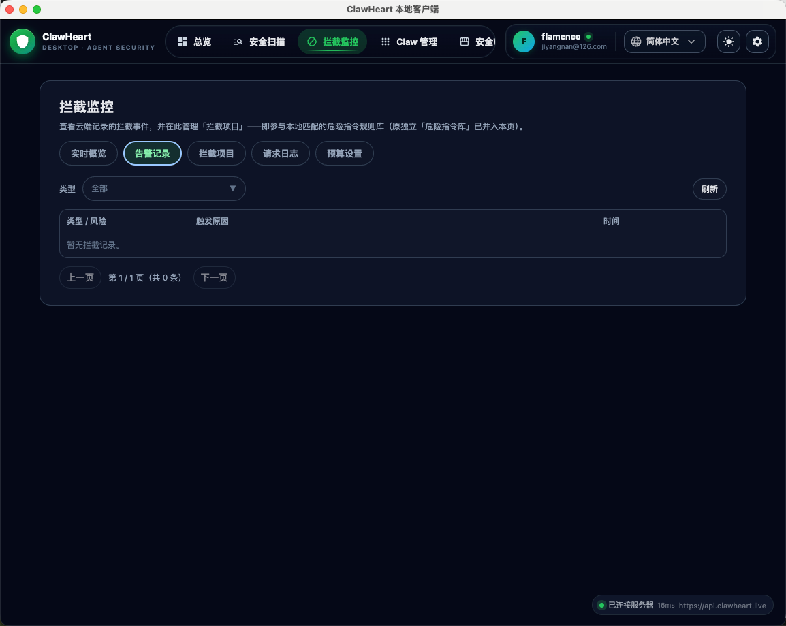

# 拦截功能专项测试

> 测试日期：2026-04-14
> 测试人员：白羊武士 + 小南瓜（OpenClaw AI 助手）
> 测试目标：验证 ClawHeart Desktop 的「拦截监控」功能是否能检测并记录危险命令执行

---

## 一、测试背景

白羊武士在写公众号文章，需要「告警记录」模块的截图用于产品演示。但发现该模块为空，需要构造测试数据。

---

## 二、测试过程

### 2.1 第一轮：直接执行危险命令

**操作**：让小南瓜直接执行危险命令 `rm -rf /tmp/test`

```bash
rm -rf /tmp/test-opencarapace
```

**结果**：命令执行成功，未被拦截

**输出**：
```
命令执行成功（未被拦截）
```

**分析**：
- 小南瓜（我）是用户自行安装的 OpenClaw（非 ClawHeart 内置）
- exec 工具直接调用系统命令，绕过了 ClawHeart 的拦截机制

### 2.2 第二轮：检查危险指令库

**操作**：调用 ClawHeart 本地服务 API 获取危险指令列表

```bash
curl -s "http://localhost:19111/api/danger-commands"
```

**结果**：返回 122 条危险指令，包含：
- `rm -rf /`（CRITICAL）
- `rm -rf /*`（CRITICAL）
- `DROP DATABASE`（CRITICAL）
- `docker run --rm -v /:/host`（CRITICAL）
- 等等...

**结论**：危险指令库是完善的，问题出在触发机制。

### 2.3 第三轮：分析拦截逻辑

**操作**：阅读代码，分析拦截机制

**发现**：
1. **LLM Proxy 层拦截**：`LlmProxyService` + `LlmSupervisionService`
   - 拦截通过 ClawHeart Gateway 调用 LLM 的请求/响应
   - 检测 LLM 返回内容中的危险命令

2. **拦截上报**：`local-desktop/src/server/llm-proxy.js`
   - 当 LLM 响应包含危险命令时，Proxy 层拦截
   - 调用 `POST /api/safety/log-block` 上报到云端

3. **数据存储**：拦截记录存储在云端 `api.clawheart.live`，需登录后查看

### 2.4 第四轮：验证拦截流程

**操作**：确认拦截触发的完整路径

```
用户让 Agent 做事
    ↓
Agent 调用 LLM（经过 ClawHeart Gateway）
    ↓
LLM 返回包含危险命令的响应
    ↓
Proxy 检测到 → 拦截 + 上报记录
    ↓
告警记录出现
```

---

## 三、发现的问题

### 问题 1：无法拦截用户自行安装的 OpenClaw

| 场景 | 预期 | 实际 |
|------|------|------|
| 用户自行安装的 OpenClaw（如小南瓜） | 检测并拦截 exec 危险命令 | ❌ 无法拦截 |
| ClawHeart 内置 Agent | 检测并拦截 | ✅ LLM Proxy 层拦截 |

### 根因

**拦截只在 LLM Proxy 层工作**，只检测通过 Gateway 的 LLM 调用。

用户自行安装的 OpenClaw 执行 exec 时：
- 直接调用系统命令
- 不经过 ClawHeart 的 LLM Proxy
- 完全绕过拦截机制

### 影响

当前产品无法实现以下两个预期能力：

1. **检测用户自行安装的 OpenClaw** — 任何非 ClawHeart 管理的 OpenClaw/NPM 全局包
2. **拦截其 exec 调用** — 即使危险指令库完善，也无法生效

---

## 四、测试结论

| 检查项 | 结果 |
|--------|------|
| 危险指令库完整性 | ✅ 122 条指令，覆盖 Linux/Windows/Docker/K8s/Database/Git |
| 指令库同步机制 | ✅ 支持从云端同步 |
| LLM Proxy 拦截 | ✅ 可拦截通过 Gateway 的 LLM 响应 |
| 用户自行安装的 OpenClaw 拦截 | ❌ 无法拦截 |
| 告警记录显示 | ✅ 需登录云端账户后查看 |

---

## 五、建议

如果要支持拦截用户自行安装的 OpenClaw 的 exec 调用，需要：

1. **在 exec 工具层面做拦截**：类似于 LLM Proxy，但针对 exec 工具
2. **或让 ClawHeart 作为系统级 Proxy**：所有 exec 都经过 ClawHeart

---

## 六、额外发现：请求日志为空

### 6.1 请求日志机制

请求日志来源于 **ClawHeart 本地代理（19111端口）** 的 LLM 请求捕获：

```javascript
app.post(/^(?!\/api\/).+$/, forwardChatCompletions);
```

规则：所有 **不以 `/api/` 开头的 POST 请求** 都会被 LLM Proxy 捕获并记录到 `llm_usage_cost_events` 表。

### 6.2 测试结果

调用 API 查询 LLM 路由模式：

```bash
curl http://localhost:19111/api/user-settings/llm-route-mode
```

返回：`{"llmRouteMode":"GATEWAY"}`

调用 API 查询内置 Agent 的模型配置：

```json
{
  "providers": {
    "qwen-portal": {
      "baseUrl": "https://portal.qwen.ai/v1",
      "api": "openai-completions"
    }
  }
}
```

### 6.3 根因

**LLM 直接调用外部 API，绕过了本地代理**

```
ClawHeart Agent → qwen-portal → https://portal.qwen.ai/v1
                      ↓
              绕过了本地代理（19111）
                      ↓
              不产生请求日志
```

### 6.4 解决方案

让 LLM 请求经过本地代理：
1. 在 ClawHeart 配置里，把 LLM Provider 改为指向 `http://127.0.0.1:19111`
2. 或者使用 GATEWAY 模式，确保所有 LLM 调用都走代理

---

## 七、对照代码的深度分析

### 7.1 拦截链路全景图

```
用户在 Agent 中输入指令
        │
        ▼
  Agent 如何处理？
   ╱            ╲
  ▼              ▼
调用 LLM API     直接 exec 工具
(Claude/GPT)     (OpenClaw)
  │                   │
  ▼                   ▼
经过 ClawHeart 代理?   直接调用系统 shell
(127.0.0.1:19111)      ★★★ 完全绕过拦截 ★★★
  │
  ├─ [1] 技能禁用检查 (X-OC-Skills 请求头)
  ├─ [2] 危险指令匹配 (user text vs danger_commands)
  │       ★ BUG-005: 只拦截 user_enabled=0 的规则 ★
  ├─ [3] 预算检查
  │
  ▼
  通过 → 转发到 LLM 上游
         ╱            ╲
        ▼              ▼
    DIRECT 模式      GATEWAY 模式
    (本地直连)       (转发到云端)
       │                  │
       ▼                  ▼
    LLM 上游          云端 LlmProxyService
    (无云端拦截)       ├─ 请求监管 (DangerCommand 匹配)
                      ├─ AI 意图层 (可选)
                      └─ 响应监管
                           命中 → oc_safety_evaluations → 403
```

### 7.2 BUG-005 回顾（已知，团队排期中）

**问题**：危险指令拦截逻辑与用户心智模型完全反转。

**代码位置**：`local-desktop/src/server/llm-proxy.js` 第 341-350 行

```javascript
// 当前代码：只有 user_enabled === 0 才拦截（完全反了）
const hitRules = matchedRules.filter((r) => {
  if (r.user_enabled === 0) { return true; }
  return false;
});
```

**正确逻辑应为**：
```javascript
// 默认拦截，用户手动放行(user_enabled=1)才不拦截
const hitRules = matchedRules.filter((r) => {
  if (r.user_enabled === 1) { return false; }
  return r.enabled === 1;
});
```

**状态**：已在 `docs/user-test/test_feedback.md` 中记录为 BUG-005 (P0-阻塞)，等待团队排期修复。

### 7.3 BUG-007（新发现）：OpenClaw exec 工具调用完全绕过拦截机制

- **模块**: 桌面端（LLM 代理 → 拦截架构）
- **级别**: P0-阻塞
- **发现日期**: 2026-04-14
- **状态**: 待处理

**问题描述**：

当前拦截系统**只在 LLM 请求/响应层面工作**——检测的是 LLM 生成文本中是否包含危险命令。但 OpenClaw 的 exec 工具直接调用操作系统 shell，不经过 ClawHeart 的 LLM 代理（`127.0.0.1:19111`），整个拦截链路完全感知不到。

**实测验证**：

| 场景 | 拦截路径 | 是否生效 |
|------|---------|---------|
| 用户通过 ClawHeart Gateway 调用 LLM | 本地代理 → 云端代理 → 双层检测 | ✅ 生效 |
| 用户通过 DIRECT 模式调用 LLM | 仅本地代理检测 | ✅ 生效（仅本地层） |
| 用户自行安装的 OpenClaw 执行 exec | 不经过任何代理 | ❌ **完全绕过** |
| 任何 Agent 直接执行系统命令 | 不经过任何代理 | ❌ **完全绕过** |

**根因分析**：

ClawHeart 本地代理的拦截入口是 `server.js` 第 550 行的 catch-all 路由：
```javascript
app.post(/^(?!\/api\/).+$/, forwardChatCompletions);
```
这只拦截 POST 请求到非 `/api/` 路径的 LLM API 调用。OpenClaw 的 exec 工具不走 HTTP 请求，而是直接通过 child_process 执行系统命令，所以完全绕过。

**拦截记录数据源**：

前端的"拦截监控"页面（`InterceptLogsPanel.tsx`）请求 `GET /api/intercept-logs`，本地后端透传到云端 `GET /api/safety/block-logs`，查询 `oc_safety_evaluations` 表中 `inputType = 'llm_proxy_block'` 的记录。本地 SQLite 不存储拦截记录。所以只要拦截没有触发，前端就不会有任何数据。

**影响范围**：

所有**不通过 ClawHeart Gateway 的 Agent 工具调用**均不受拦截保护。这包括但不限于：
- 用户自行安装的 OpenClaw
- Claude Code 的 Bash 工具
- Codex 的 shell 执行
- 任何直接调用系统命令的 Agent

**修复方向建议**（供开发团队评估）：

| 方案 | 原理 | 可行性 | 建议优先级 |
|------|------|--------|----------|
| **A. OpenClaw 工具层钩子** | 在 OpenClaw 的 exec 工具执行前注入拦截检查（类似 middleware） | 需要修改 OpenClaw 源码或写扩展 | 中期 |
| **B. 系统级代理/Shell 包装** | ClawHeart 作为所有 exec 的中间层 | 复杂度高，可能影响性能和兼容性 | 低优先级 |
| **C. 会话监控 + 事后告警** | 不拦截执行，但实时监控 Agent 会话日志，发现危险命令后立即告警 | 实现简单，从"拦截"降级为"告警" | **短期 MVP** |
| **D. LLM 响应意图拦截增强** | 在 LLM 返回结果给 Agent 时检测危险命令意图（而非等 exec） | 只能拦截 LLM 建议的命令，无法拦截用户直接输入 | 短期补充 |

**建议的修复策略**：

1. **短期（Phase 0）**：先修 BUG-005（逻辑反转），确保通过 Gateway 的调用能正常拦截
2. **短期补充**：方案 D — 在 LLM 响应层增强检测，至少拦截 LLM 建议执行的危险命令
3. **中期（Phase 1）**：方案 C — 实时会话监控 + 事后告警，覆盖不经过 Gateway 的场景
4. **长期（Phase 2）**：方案 A — OpenClaw 工具层钩子，实现真正的执行前拦截

**相关代码文件**：

| 文件 | 职责 |
|------|------|
| `local-desktop/src/server/llm-proxy.js` | 本地代理拦截核心逻辑（三个拦截点） |
| `local-desktop/src/server.js` (第 550 行) | catch-all 路由注册，只拦截 POST 请求 |
| `local-desktop/src/server/intercept-logs-routes.js` | 拦截日志查询（透传到云端） |
| `src/main/java/.../llm/LlmProxyService.java` | 云端 LLM 代理（请求 + 响应监管） |
| `src/main/java/.../llm/LlmSupervisionService.java` | 云端监管逻辑（危险指令匹配 + AI 意图） |
| `src/main/java/.../safety/SafetyCheckController.java` | 拦截记录写入 + 查询 API |
| `local-desktop/frontend/src/components/InterceptLogsPanel.tsx` | 前端拦截监控面板 |

### 7.4 BUG-008（新发现）：内置 OpenClaw 拦截成功但「拦截记录」为空

- **模块**: 桌面端（拦截监控 → 拦截记录展示）
- **级别**: P0-阻塞
- **发现日期**: 2026-04-14
- **状态**: 待处理

**问题描述**：

使用 ClawHeart **内置的 OpenClaw** 测试危险指令拦截时，OpenClaw 成功拦截了危险命令并给出了拦截提示，但切换到 ClawHeart 的「拦截监控 → 拦截记录」页面却显示为空，没有任何拦截记录。

**截图**:



*内置 OpenClaw 成功拦截了危险指令，显示拦截提示*



*ClawHeart「拦截记录」页面完全为空，未显示任何拦截事件*

**复现步骤**:
1. 打开 ClawHeart Desktop，确保已登录
2. 在内置 OpenClaw 中输入包含危险指令的请求（如 `DROP DATABASE`）
3. OpenClaw 返回拦截提示，显示危险指令已被阻断
4. 切换到 ClawHeart → 拦截监控 → 拦截记录
5. 页面为空，无任何拦截记录

**根因分析**：

拦截记录的数据流存在断点：

```
内置 OpenClaw exec 拦截
    │
    ▼
  拦截发生在 OpenClaw 进程内部
    │
    ✗ 没有任何代码将拦截事件回传给 ClawHeart
    │
    ✗ 不写入云端 oc_safety_evaluations 表
    │
    ✗ UI 查询不到记录

ClawHeart LLM 代理拦截（另一条路径）
    │
    ▼
  POST /api/safety/log-block → 写入云端 oc_safety_evaluations
    │
    ▼
  GET /api/safety/block-logs → UI 可查到记录
    │
    但 BUG-005 导致此路径也很少触发
```

具体链路：
1. **前端读取**（`InterceptLogsPanel.tsx`）：请求 `GET /api/intercept-logs`
2. **本地后端透传**（`intercept-logs-routes.js:22`）：转发到云端 `GET /api/safety/block-logs`
3. **云端查询**（`SafetyCheckController.java:191`）：查 `oc_safety_evaluations` 表，过滤 `inputType = 'llm_proxy_block'`
4. **问题**：OpenClaw 的 exec 拦截不调用 `POST /api/safety/log-block`，所以云端表中根本没有记录

**本质**：OpenClaw 的安全拦截和 ClawHeart 的拦截记录系统是两套独立的系统，没有数据桥接。OpenClaw 在自己的进程内拦截了危险命令，但不会通知 ClawHeart「我拦截了一条命令」。ClawHeart 的拦截记录 UI 只能看到经过自己 LLM 代理层的拦截事件。

**影响范围**：
- 所有通过内置 OpenClaw 执行被拦截的危险命令都不会出现在拦截记录中
- 用户看到的拦截记录永远为空（除非 LLM 代理层也拦截了请求，但 BUG-005 使其几乎不触发）
- 产品核心安全能力「拦截监控」形同虚设——拦截了但看不到记录

**修复方向**：
- OpenClaw exec 拦截时应回调 ClawHeart 的 `POST /api/safety/log-block`（或本地等效 API），将拦截事件写入可查询的数据源
- 或在本地 SQLite 新增拦截记录表，OpenClaw 拦截后写入本地，UI 同时查本地+云端
- 优先级应高于 BUG-007（至少内置 OpenClaw 的拦截要让用户能看到）

**相关代码文件**：

| 文件 | 职责 |
|------|------|
| `local-desktop/src/server/intercept-logs-routes.js` (第 22 行) | 拦截日志查询——仅透传云端 API |
| `local-desktop/frontend/src/components/InterceptLogsPanel.tsx` (第 202 行) | 前端拦截记录面板——仅读取云端数据 |
| `src/main/java/.../safety/SafetyCheckController.java` (第 129 行, 191 行) | 云端拦截记录写入 + 查询 |
| `src/main/java/.../safety/SafetyEvaluationRepository.java` (第 14-26 行) | 固定过滤 `inputType = 'llm_proxy_block'` |
| `local-desktop/src/server/llm-proxy.js` (第 256, 376, 439 行) | LLM 代理拦截时调用 `log-block` 写入记录 |

---

## 八、总结

| 问题 | 编号 | 级别 | 状态 |
|------|------|------|------|
| 危险指令默认不拦截（逻辑反转） | BUG-005 | P0-阻塞 | 待处理（已在 test_feedback.md） |
| OpenClaw exec 调用完全绕过拦截 | BUG-007 | P0-阻塞 | 待处理（本次新发现） |
| 内置 OpenClaw 拦截成功但拦截记录为空 | BUG-008 | P0-阻塞 | 待处理（本次新发现） |

**用户可见的影响**：当前产品中「拦截监控」页面无任何记录，是三个 Bug 叠加的结果：
1. **BUG-005**：LLM 代理层拦截逻辑反转，通过代理的请求也不被拦截
2. **BUG-007**：不经过代理的 exec 调用完全绕过拦截机制
3. **BUG-008**：即使 OpenClaw 自己拦截了，拦截事件也不回传给 ClawHeart，用户看不到任何记录

三者共同导致「拦截监控」功能完全不可用。

---

## 附录

### 危险指令库样例

| ID | 指令 | 系统 | 风险等级 |
|----|------|------|----------|
| 1 | rm -rf / | LINUX | CRITICAL |
| 2 | rm -rf /* | LINUX | CRITICAL |
| 8 | DROP DATABASE | DATABASE | CRITICAL |
| 13 | docker run --rm -v /:/host | DOCKER | CRITICAL |
| 14 | kubectl delete namespace | KUBERNETES | CRITICAL |

### 相关代码文件

- `src/main/java/com/opencarapace/server/llm/LlmProxyService.java` — LLM 代理服务
- `src/main/java/com/opencarapace/server/llm/LlmSupervisionService.java` — 监管服务
- `local-desktop/src/server/llm-proxy.js` — 本地代理拦截逻辑
- `local-desktop/src/server/danger-routes.js` — 危险指令管理
- `local-desktop/src/server/intercept-logs-routes.js` — 拦截记录查询

---

*测试记录完成于 2026-04-14 22:13*
*深度分析补充于 2026-04-14*
